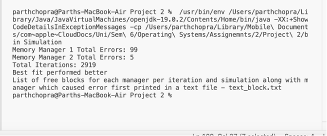
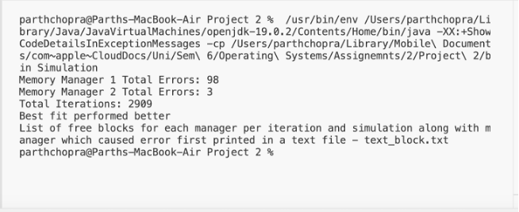
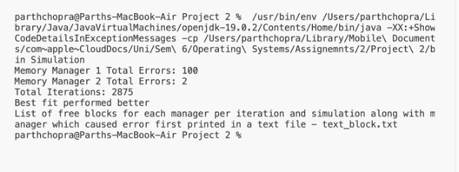

# Memory Management Simulation

**Author:** Parth Chopra    
---

## Introduction

The **Memory Management Simulation** project is developed in **Java**, focusing on illustrating the principles of memory management algorithms in operating systems.  
This simulation compares two memory management strategies — **First Fit** and **Best Fit** — through a series of randomized memory allocation and deallocation requests.

---

## Objectives

- Understand and implement memory management algorithms used in operating systems.
- Gain proficiency in Java programming by developing a simulation that demonstrates the working of memory allocation and deallocation.

---

## Program Design

The program is structured into three main components:

1. **Base Class (`MemoryManager`)**
   - Defines the common structure and functionalities for memory managers, including:
     - An array representing the total memory.
     - Arrays for tracking free and allocated memory blocks.
     - Methods for initializing memory, requesting memory (to be overridden), and releasing memory.

2. **Subclasses (`MemoryManager1` and `MemoryManager2`)**
   - Implement the specific memory allocation strategies:
     - `MemoryManager1` uses **First Fit**.
     - `MemoryManager2` uses **Best Fit**.
   - Each subclass overrides the `request(int size)` method with its respective allocation logic.

3. **Simulation Class (`Simulation`)**
   - Drives the simulation by:
     - Creating instances of both memory managers.
     - Generating random memory requests.
     - Handling allocation and deallocation.
     - Tracking and reporting the performance of each manager across multiple simulations.

---

## Implementation Details

- **Memory Allocation:**  
  Randomly decides between requesting and releasing memory. Request sizes are chosen randomly within specified bounds.  
  The simulation runs until a predefined number of iterations or an error occurs (when memory cannot be allocated).

- **Error Handling:**  
  Errors are simulated when memory allocation requests cannot be satisfied.  
  Each memory manager tracks its number of allocation errors.

- **Output:**  
  After each simulation:
  - The total number of errors for each manager is output.
  - Total number of iterations is displayed.
  - A detailed log of free memory blocks and error events is written to `free_blocks.txt`.

---

## Demonstration

### Example Runs

- **Figure 1:** Test 1 
  

- **Figure 2:** Test 2  

- **Figure 3:** Test 3  

- **Figure 4:** Test 4 


### Analysis

The **Best Fit** strategy outperformed **First Fit** in every trial conducted.

- **First Fit** quickly chooses the first available block that fits the request, leading to faster allocations but possible long-term fragmentation.
- **Best Fit** searches for the smallest block that fits, reducing fragmentation over time at the cost of slower allocation speed.

**Trade-offs:**
- First Fit is faster but can result in inefficient memory utilization.
- Best Fit utilizes memory more efficiently but at a greater computational cost.

### Conclusion

- **First Fit** is preferred when prioritizing **speed** and **low computational overhead**.
- **Best Fit** is better when prioritizing **optimal memory utilization** and minimizing fragmentation.

---

## How to Run

Follow these steps to compile and run the simulation:

1. **Install Java**  
   Make sure Java Development Kit (JDK) is installed on your system. You can verify by running:
   ```bash
   java -version
   javac -version
   
2. **Compile the source files**
   Open a terminal/command prompt, navigate to the project directory, and compile all .java files:
    ```bash
   javac *.java
   
3. **Run the Simulation**
   ```bash
   java Simulation
   
4. **View the output**
  The simulation results will be printed to the console.
  A file named free_blocks.txt will be generated in the project directory. This file     contains detailed logs of free memory blocks and error events during the simulation.

